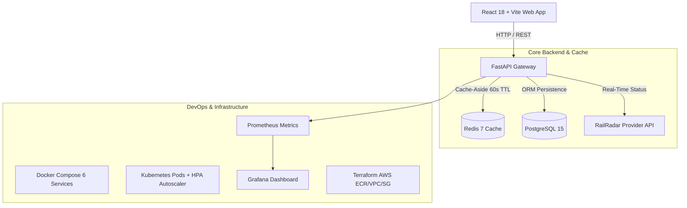

# 🚆 RailPulse India — Intelligent Train Tracking & Operations Scheduling Platform

[](LICENSE)
[](https://www.python.org/)
[](https://react.dev/)
[](https://fastapi.tiangolo.com/)
[](https://www.docker.com/)
[](https://kubernetes.io/)
[](https://www.terraform.io/)
[](backend/tests/)

**RailPulse India** is a passenger-facing journey tracking and railway operations scheduling intelligence platform designed to provide passengers with fast, low-bandwidth journey status, live delay calculation, and data freshness indicators powered by the **RailRadar API**, while empowering railway operators with station platform occupancy tracking, interval overlap conflict detection, and automated dispatch recommendations.

---

## ✨ Core Features

### 🚄 Passenger Journey Tracker (Real-Time RailRadar Engine)
- **Live Flagship Train Search**: Search Indian Railways flagship trains (`12951` Mumbai Rajdhani, `22436` Vande Bharat, `12002` Bhopal Shatabdi, `12259` Sealdah Duronto, etc.).
- **Route & Station Timeline**: Interactive station sequence with completed stops, active leg highlights, scheduled vs. actual arrival/departure, and remaining distance.
- **Live ETA & Delay Engine**: Computes station-level delays in minutes and predicts next station arrival times without false precision.
- **Dual Fallback Resiliency**:
  - *Server-Side Fallback*: Upstream API degradation triggers fallback to stale Redis cache (`degraded: true`, `source: "CACHED"`).
  - *Client-Side Offline Mode*: Backend outage triggers browser `localStorage` fallback with an offline alert banner (`source: "OFFLINE_LOCAL"`).

### 🎛️ Operations & Scheduling Intelligence (Control Room Mode)
- **Station Platform Occupancy Board**: Real-time platform status (`NDLS`, `MMCT`, `RKMP`, `BSB`, `TVC`) displaying `AVAILABLE` 🟢, `OCCUPIED` 🔴, or `CONFLICT` 🟡.
- **Interval Overlap Conflict Detector**: Evaluates arrival/departure time windows per platform to detect overlapping schedules.
- **Automated Dispatch Recommendations**: Suggests alternative platforms or adjusted departure slots to clear station bottlenecks.

---

## 📐 System Architecture



---

## 🛠️ Tech Stack

| Component | Technology | Description |
|---|---|---|
| **Frontend** | React 18, TypeScript, Vite, TailwindCSS | Liquid glassmorphism UI with Apple/Linear dark aesthetic |
| **Backend** | FastAPI, Python 3.11, Pydantic V2 | Async REST API with SRE probes and RailRadar provider |
| **Database** | PostgreSQL 15, SQLAlchemy | Relational persistence for trains, stops, and journey status |
| **Cache** | Redis 7 | Cache-aside layer with 60s TTL and stale-cache fallback |
| **Containerization** | Docker, Docker Compose | 6-container production stack with health checks |
| **Orchestration** | Kubernetes (Minikube / EKS) | HPA autoscaling, readiness/liveness probes, rolling updates |
| **Infrastructure-as-Code** | Terraform | AWS ECR, VPC, Subnets, and Security Groups automation |
| **Monitoring** | Prometheus, Grafana | RED metrics, Redis cache hit ratio, request latency tracking |
| **CI/CD** | GitHub Actions | Dual pipeline with Pytest test runner and Trivy security scanner |

---

## 🚀 Quick Start Guide

### 1. Run with Docker Compose (Easiest)
```bash
# Clone repository
git clone https://github.com/a7hu-15/train-schedule-devops.git
cd train-schedule-devops

# Build and start all 6 services
docker compose up -d --build

# Verify container status
docker compose ps
```
Access points:
- **Frontend App**: `http://localhost:3000`
- **FastAPI Docs**: `http://localhost:8000/docs`
- **Prometheus**: `http://localhost:9090`
- **Grafana**: `http://localhost:3001` (admin/admin)

---

### 2. Run Backend Unit Tests (20/20 Passed)
```bash
cd backend
python3 -m venv venv
source venv/bin/activate
pip install -r requirements.txt

# Run pytest test suite
PYTHONPATH=. pytest tests/ -v
```

---

### 3. Deploy on Kubernetes
```bash
# Apply all K8s manifests
kubectl apply -f infra/k8s/

# Verify pods and horizontal pod autoscaler
kubectl get pods -n railpulse
kubectl get hpa -n railpulse
```

---

### 4. Synthesize Infrastructure with Terraform
```bash
cd infra/terraform
./terraform init -backend=false
./terraform plan
```

---

## 📁 Directory Structure

```text
RailPulse/
├── README.md                           # Master Project Documentation
├── LICENSE                             # MIT License
├── CHANGELOG.md                        # Version Release History
├── CONTRIBUTING.md                     # Contribution Guidelines
├── docker-compose.yml                  # 6-Service Docker Compose Spec
├── docs/
│   └── RAILPULSE_FINAL_PROJECT_REPORT.md # Comprehensive Final Report & Viva Guide
├── backend/                            # FastAPI Python 3.11 Microservice
│   ├── app/                            # API routes, schemas, models, services, providers
│   ├── tests/                          # 20 Pytest Unit & Integration Tests
│   └── Dockerfile
├── frontend/                           # React 18 + TypeScript Web App
│   ├── src/                            # Components, pages, design system
│   └── Dockerfile
├── infra/
│   ├── k8s/                            # Kubernetes Manifests (HPA, Deployments, Secrets)
│   └── terraform/                      # AWS IaC (VPC, Subnets, ECR, Security Groups)
└── ops/
    ├── monitoring/                     # Prometheus & Grafana Dashboard Configs
    └── workflows/                      # GitHub Actions CI & Trivy Security Scans
```

---

## 📜 License & Author

Distributed under the **MIT License**. See [`LICENSE`](LICENSE) for details.

Developed with ❤️ by **Ashu Chaudhary** (RailPulse Team).

